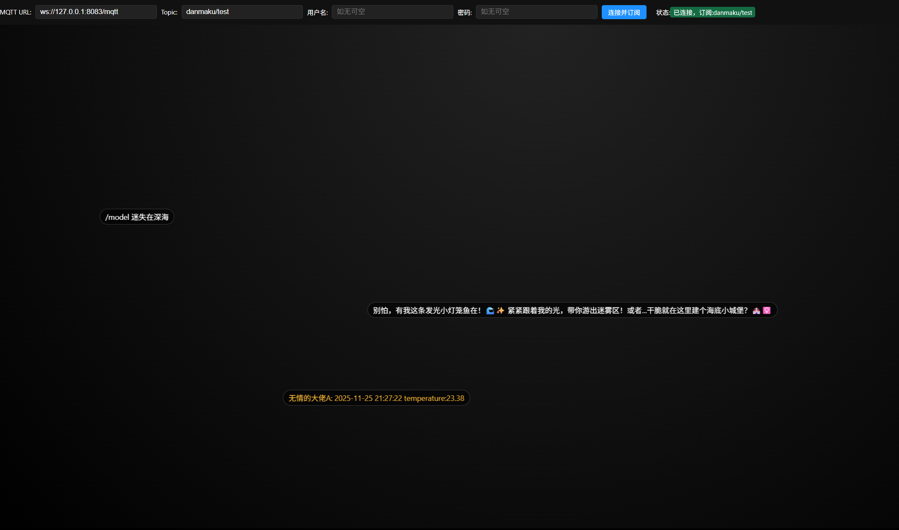
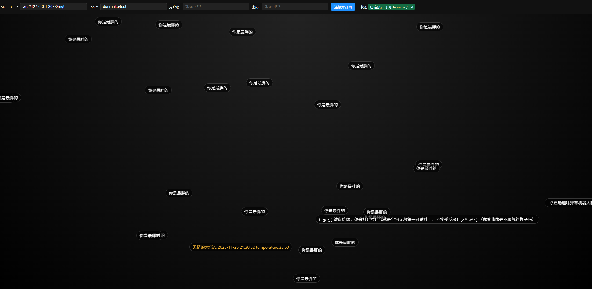

# 项目说明

## 项目概述
基于 NXP MCXA156 与 RT-Thread 的物联网演示：上电输出欢迎信息并闪烁 LED，周期读取 P3T1755 温度，经 MQTT 上报；同时监听弹幕式文本，可触发大模型回复再回传。网络侧采用 CherryUSB CDC-RNDIS 让主机直连成网口，无需额外网卡。

## 功能介绍
- LED 心跳：`applications/main.c` 中以 500ms 周期闪烁板载 LED，提示系统运行状态。
- 温度采集与上报：`applications/mqtt_temp_publisher.c` 读取 P3T1755 温度，生成 JSON 载荷，定时发布到 `danmaku/test` 主题。
- 弹幕交互与大模型回复：订阅 `danmaku/test`，支持 `/model <text>` 指令或每 10 条消息触发一次大模型（HTTP 调用），将回复再发布到同主题。
- 文件系统：启动时挂载 `mflash` 到 `/`，便于存储配置或日志。
- RNDIS 联网：通过 CherryUSB CDC-RNDIS 暴露虚拟网卡，lwIP 获取 DHCP（或按 `RT_LWIP_IPADDR` 静态地址）即可访问 MQTT 与 HTTP 服务。

## RT-Thread 使用概述
- 组件：Paho MQTT、WebClient、cJSON、netutils(NTP)、lwIP、CherryUSB RNDIS、RT-Thread workqueue、PIN 驱动、LFS/DFS（见 `rtconfig.h`）。
- 线程：独立温度发布线程；大模型请求经系统工作队列异步执行。
- 日志：统一 `LOG_D/I/W/E`；核心参数在 `rtconfig.py`/`rtconfig.h` 中配置。

## 硬件框架
- MCU：NXP MCXA156 (Cortex-M33)。
- 传感器：P3T1755 温度传感器（I2C 总线，典型地址 0x48）；若使用外接模块，请将 SDA/SCL 接到板载 I2C 通道并提供 3.3V 供电。
- 指示灯：LED 连接到 `PORT3_12`（`LED_PIN ((3*32)+12)`）。
- 通讯：RNDIS 虚拟网卡直连上位机；lwIP 侧支持 DHCP/静态 IPv4（默认 192.168.1.30/24）。

## 软件框架说明
- 目录结构：  
  - `applications/`：业务逻辑与应用线程。  
  - `board/`：BSP 初始化、时钟和链接脚本。  
  - `Libraries/`、`packages/`：芯片厂商驱动与 RT-Thread 组件。  
- 构建：先执行 `pkgs --update`（必要时 `pkgs --upgrade`），再运行 `scons -j4` 生成 `rtthread.elf/bin/map`；`scons --menuconfig` 进行组件选择；`scons -c` 清理。
- 烧录：使用常用 MCXA156 流程 (J-Link/pyOCD 等) 将 `rtthread.bin` 写入 Flash。

## 目录文件说明
- `applications/`：应用源代码与线程入口（LED 心跳、温度 MQTT、弹幕/模型交互）。
- `board/`：BSP 初始化、时钟配置、链接脚本。
- `Libraries/`：NXP MCX 驱动库。
- `packages/`：RT-Thread 组件与第三方包（MQTT、WebClient、netutils、P3T1755 等）。
- `rt-thread/`：RT-Thread 内核与官方组件，视为第三方依赖。
- `build/`：默认构建输出目录（中间文件）。
- `rtthread.elf/bin/map`：SCons 生成的镜像与符号信息。
- `demo/`：网页弹幕墙及示例截图。
- `tool/`：调试与配套工具（MQTTX 客户端、本地 EMQX Broker 压缩包）。

## 软件模块说明
- `main.c`：启动提示、文件系统挂载、LED 心跳循环。
- `mqtt_temp_publisher.c`：MQTT 客户端初始化、温度采集发布、消息订阅与大模型请求调度。
- `rtconfig.py`：工具链与编译选项，需设置 `RTT_EXEC_PATH`/`RTT_ROOT` 环境变量。
- `demo/mqtt_danmaku.html`：PC 端弹幕墙网页，浏览器直连 MQTT Broker（WS），实时显示 JSON/文本弹幕并配色区分用户。

## 开发环境搭建
- 工具链：ARM GCC（`arm-none-eabi-`），安装后将路径填入 `RTT_EXEC_PATH` 环境变量，或修改 `rtconfig.py`。
- 主机依赖：Python/SCons、RT-Thread `pkgs` 工具；执行 `pkgs --update` 拉取 `packages/`。
- 调试与烧录：推荐 VSCODE直接打开工作区 调试配置已经写好 代码中使用串口 `uart0` 为控制台。
- RNDIS 主机侧：插上 USB 后在 PC 设备管理器/网卡列表看到虚拟网卡，设置共享/桥接或静态 IP（同网段 192.168.1.x）以便板端获取地址。

## 调试工具与使用
- msh 网络命令：`ifconfig` 查看 RNDIS 网卡，`ping <host>` 测试链路，`netstat` 检查 MQTT/TCP 连接。
- 抓包分析：启用 netutils 后可用 `tcpdump -i e0 -c 20` 抓取 RNDIS 接口流量，排查 MQTT/HTTP 访问问题。
- 线程/资源：`list_thread`、`list_timer` 观察线程与定时器；日志级别通过 `rtconfig.h` 的 `ULOG_OUTPUT_LVL` 控制。

## 工具目录说明
- `tool/MQTTX-Setup-1.12.1.exe`：跨平台 MQTT 可视化客户端，安装后配置 `ws://<broker>:8083/mqtt` 或 `tcp://<broker>:1883`，订阅/发布 `danmaku/test` 便于观测消息。
- `tool/emqx-5.3.2-windows-amd64.zip`：可选本地 MQTT Broker，解压后进入\bin目录下，启动cmd输入emqx start启动，适合离线演示与本机联调。
- 因文件太大 故放在仓库的release中 请自行下载
## 演示效果
- 串口/终端输出编译器信息与 “MCXA156 HelloWorld”。
- LED 以 0.5s 周期闪烁。
- MQTT 代理可见周期性温度 JSON 消息；接收 `/model xxx` 消息后，约几秒内返回模型生成的回复。
- PC 端弹幕墙示例：  
    
  

## 代码地址
- 本仓库根目录即项目代码，核心应用位于 `applications/`。
- https://github.com/illustriousness/frdm-mcxa156-rndis

## 提交材料
- 项目设计文档：包含项目概述、功能介绍、硬件连接图、软件代码说明、扩展板原理图等。
- 源码与工程：SCons 工程、`applications/` 业务代码、`board/` BSP 配置。
- 演示记录：运行日志截屏、MQTT 交互截图或视频，硬件连接示意图。 
